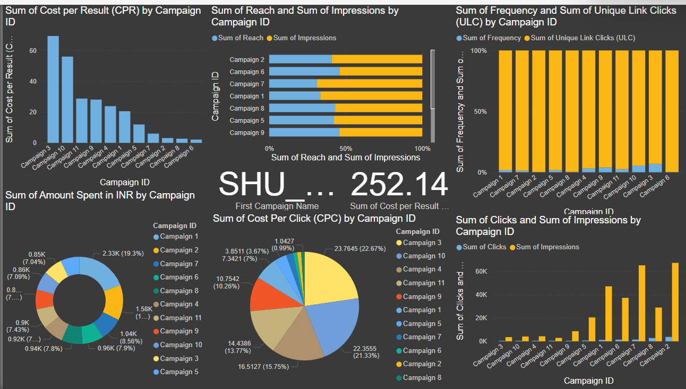

# Superhero-U-Ad-Campaign
Superhero U by Globalshala empowers students to be community superheroes. With workshops, activities, and networking, it fosters leadership, social entrepreneurship, and tackling global issues. It unleashes students' potential, connecting them with mentors and peers, fostering impactful change.

# My PowerBI Dashboard

This is a link to my live PowerBI dashboard. Click the image below to open it:

---

# DATA ANALYSIS RESULTS

## Targeted Audiences
* Interns/Students
* Educators & Principals (Campaign 1 only)
  
## Campaign Breakdown
* Campaign 1: Educators & Principals (Australia, Canada, UK, Ghana, Nigeria, Pakistan, USA)
* Campaign 2: Students (Excluding India & USA) - Australia, Canada, UK, Ghana, Niger, Nigeria, Nepal, Pakistan, Thailand, Taiwan
* Campaigns 3-11: Students (Individual Countries)
* Campaign 3: Australia
* Campaign 4: Canada
* Campaign 5: Ghana
* Campaign 6: India
* Campaign 7: Nepal
* Campaign 8: Nigeria
* Campaign 9: UAE
* Campaign 10: UK
* Campaign 11: USA
  
## Discontinued Campaign - SHU_Students (Australia, Age 24-35)

### Reasons for Discontinuation:

1. High Cost per Result (CPR) (23.11 Rs) - Indicates high cost per click.
2. Low Frequency (1.047) - Low ad exposure for the target audience.
3. Low Clicks & Impressions Ratio (0.3331) - Low click-through rate.
   
### Conclusion
***Data analysis of Superhero U's ad campaigns suggests discontinuing Campaign 3 due to poor performance and misalignment with marketing objectives.***

### Recommendation:
Reallocate resources from Campaign 3 to focus on more promising growth opportunities and maximize ROI (Return on Investment).
